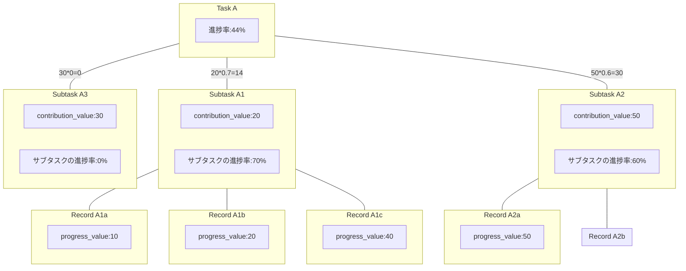
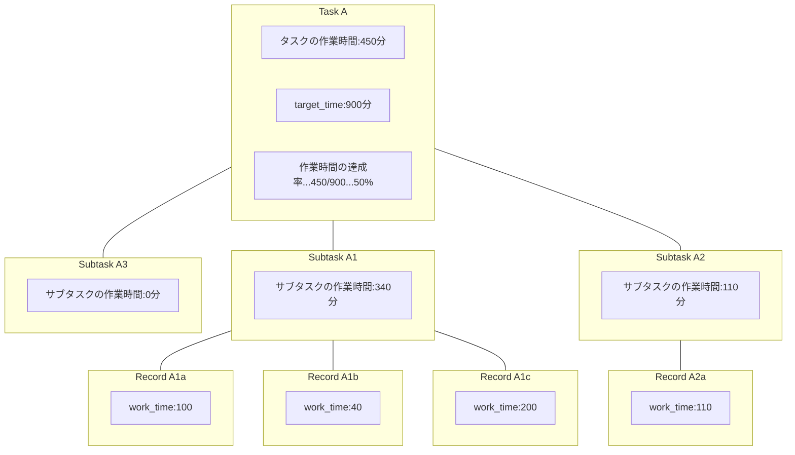

## タスクの進捗率の算出

## 凡例と前提

- __contribution_value__: サブタスクのタスク進捗への寄与度（重み）。タスク内合計は100。
- __progress_value__: 実績入力時の進捗差分（%）。サブタスクで累積（最大100%）。
- 図中の `20*0.7=14` は「寄与度20 × サブタスク進捗70% = タスクへの寄与14pt」を意味。
- A1のサブタスク進捗70%は `10 + 20 + 40 = 70` から計算。A2の60%は `50 + 10 = 60` から計算。

## 数式（定義）

- サブタスク進捗（%）
  - `subtask_progress = clamp( Σ record_works.progress_value, 0, 100 )`
- タスク進捗（%）
  - `task_progress = Σ( subtask_progress_s × contribution_value_s ) / 100`

## バリデーションと業務ルール

- __寄与度合計__: 同一タスク配下の `contribution_value` 合計=100 必須。
- __進捗差分範囲__: `progress_value` は 0〜100（差分）。負値不可。
- __累積上限__: サブタスク累積は100でクランプ（超過分は無視）。
- __再計算__: 実績の作成/更新/削除時にサブタスク→タスク進捗を再計算。

## 予定と実績の対比（参考）

- 時間: `Σ record_works.work_time` と `tasks.target_time` を比較して達成率を算出。
- 件数/ポイント: `daily_work_plans`、時間: `daily_time_plans` をダッシュボードで予定対実績の比較に利用（`design_docs/er_diagram.md` 参照）。

## タスクの作業時間の算出
